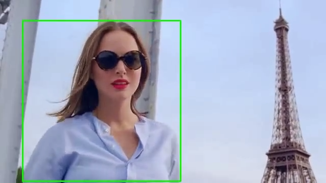

# Detection of persons in a Youtube video

<p align="center">    
    <a href='MISS_DIOR_The_new_Eau_de_Parfum_detect.mp4'>
        
    <a/>
<p/>

<p align="center">^^click here^^<p/>


## Objective

Given the url of a Youtube video
(here the [Dior - Eau de Parfum](https://www.youtube.com/watch?v=h4s0llOpKrU) commercial),
generate a new video that shows the presence of humans by drawing bounding boxes around them.


## Methodology

### Overall principle

1. split the video into frames;
2. apply a detection model every _K_ frame;
3. for each frame, interpolate the bounding boxes found by the model
    if no detection has been run on it;
5. draw the bounding boxes found for each frame;
4. recombine the frames into the final video.

### Some details

:point_right:
For the detection model, the script loads either __RetinaNet__ or __Faster R-CNN__ from
[torchivion.models](https://pytorch.org/docs/stable/torchvision/models.html#object-detection-instance-segmentation-and-person-keypoint-detection)

:point_right:
To speed up the processing time, the detection of persons is performed on every _K_ frame,
where _K_ can be selected by the user.

:point_right:
To find the bounding boxes on frames where no detection is performed, the script interpolates
boxes between two successive frames where a detection has been made.
To decide whether two boxes on two different frames correspond to the same person,
it first checks that they have a similar size, and then it selects the pair of boxes
that yields the highest IoU scores for each pair of interpolated boxes.
Finally, it checks that these IoU scores are above some threshold
(to avoid interpolating boxes that are too far apart) and that the confidence level of
at least one box is high enough (to avoid detection of false positive).

The principle of the algorithm is described below,
where `T(box)` is a box with same size but with its lower-left corner (in Cartesian coordinates)
translated to the origin and `conf(box)` is the confidence level associated to a box:

```
input:  boxes0, boxes1 (boxes found on successive frames, frame0 and frame1,
        where detection has been run and ordered by decreasing confidence level)
output: final_boxes (list of bounding boxes for each frame between frame0 and frame1)

params: min_IoU, min_conf

for each box1 in boxes1:
    best_IoU <- 0
    best_box <- None
    for each box0 in boxes0:
        if IoU(T(box0), T(box1)) < min_IoU:
            continue
        interpolate(box0, box1)
        score <- min(IoU bewteen successive interpolated boxes)
        if score > best_score:
            best_IoU <- score
            best_box <- box0
    if best_IoU > min_IoU and (conf(best_box) > min_conf or conf(box1) > min_conf):
        boxes0 <- boxes0 \ {best_box}
        add each box in interpolate(best_box, box1) to final_boxes
```

:point_right:
Previously to the latter algorithm, a first selection is made to filter out bounding boxes
for which the confidence level is below some threshold `eps`.

### Some remarks

:triangular_flag_on_post:
The above algorithm will display a box even if its confidence level is below `min_IoU`,
provided a similar box with a high confidence level is detected on the previous or the next frame.
In other words, it decreases the number of false negative detections (and symmetrically
increases the number of false positives).

:triangular_flag_on_post:
On the other hand, if the primary concern is reducing the number of false positive detections,
it is better to set `eps = min_conf = 0.5` (or any suitable value).


## How to run the detection

First, set up a python virtual environment with pytorch and torchivision
(see details [here](https://pytorch.org/get-started/locally/)).
The script has been tested with __Python==3.8__ and __Pytorch==1.7__.
Then, install the required packages:
```
python -m pip install -U -r requirements.txt
```

To generate the [output video](MISS_DIOR_The_new_Eau_de_Parfum_detect.mp4), run the script
```
(env)$ python detect.py --stride=4 --eps=0.3 --min_conf=0.7 --min_iou=0.66 --with_conf`
```
The input video is automatically downloaded in the same folder as the script `detect.py`,
and the output video is created at the same location.
To try with another video, add `--url='https://youtu.be/<xxx>'`.

To use the GPU, add the argument `--with_gpu` and choose an adequate batch size (say 4)
with `--batch_size=4`.

To use __Faster R-CNN__ instead if __RetinaNet__, add the argument `--model='fasterrcnn'`.
